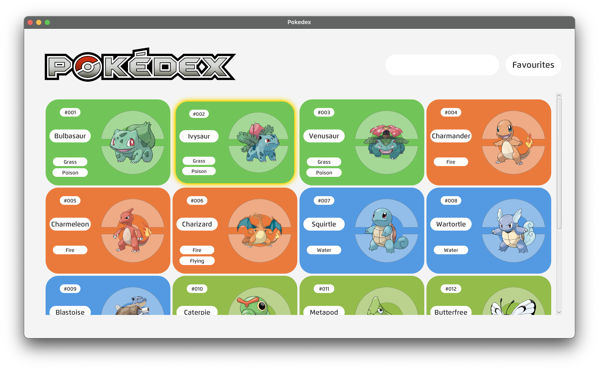
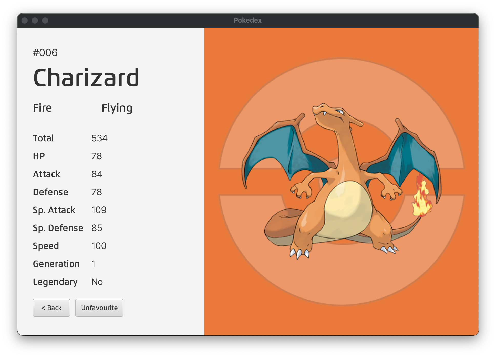
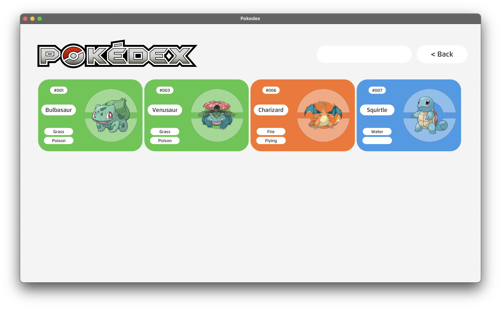
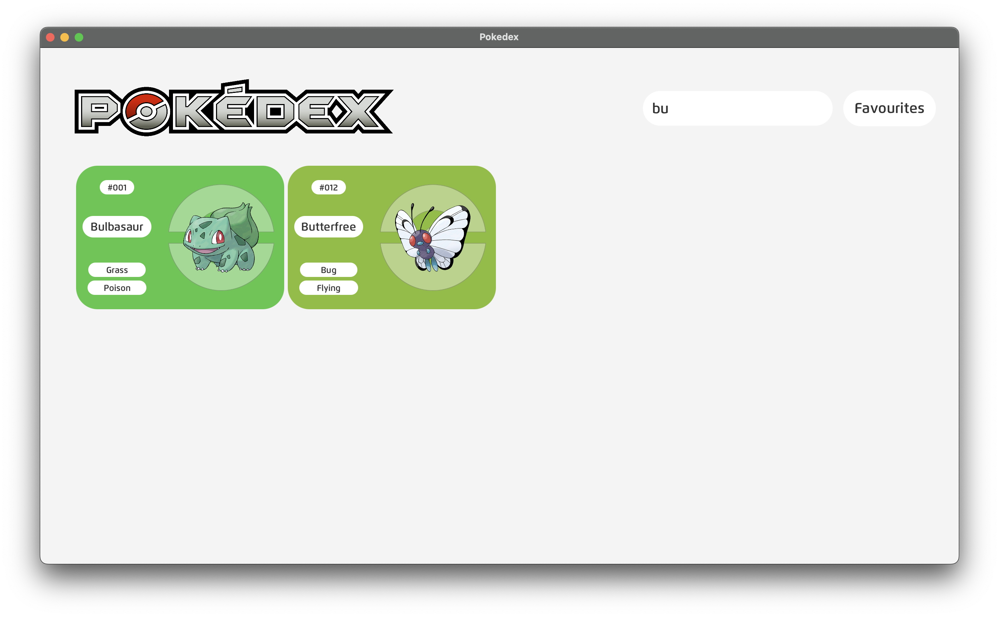

## Description

This is a desktop application built with JavaFX that serves as a Pokédex. It is connected to a MySQL database to provide information about various Pokémon. Users can view details of each Pokémon, search for specific Pokémon, and add them to their favorites.

## Features

- **Pokémon Information**: View detailed information about each Pokémon, including its name, type and stats.
- **Search Functionality**: Easily search for Pokémon by name.
- **Favorites**: Add Pokémon to favorites for quick access to their information.
- **MySQL Database Integration**: All Pokémon data is stored and retrieved from a MySQL database, ensuring scalability and reliability.
- **User-Friendly Interface**: Intuitive and visually appealing interface for smooth navigation and interaction.

## Getting Started

### Prerequisites

- Java Development Kit (JDK)
- MySQL Database

### Installation

1. Clone the repository:
```bash
git clone https://github.com/yourusername/pokedex-javafx.git
```
2. Import the project into your preferred Java IDE.
3. Setup JavaFX.
4. Setup a MySQL database using the provided `pokemon.csv` or `pokemon.json` file.
5. Modify the `DatabaseController.java` file to use your specified username and password.
6. Run `Main.java`.

### Usage

1. Upon launching the application, you will be presented with the Pokédex interface.
2. Click on a Pokémon to view its detailed information.
3. To add a Pokémon to favorites, click the "Favourite" button.
4. Use the search bar to find specific Pokémon by name.

## Screenshots

### Main Interface

### Info Screen

### Favourites Interface

### Search Functionality

